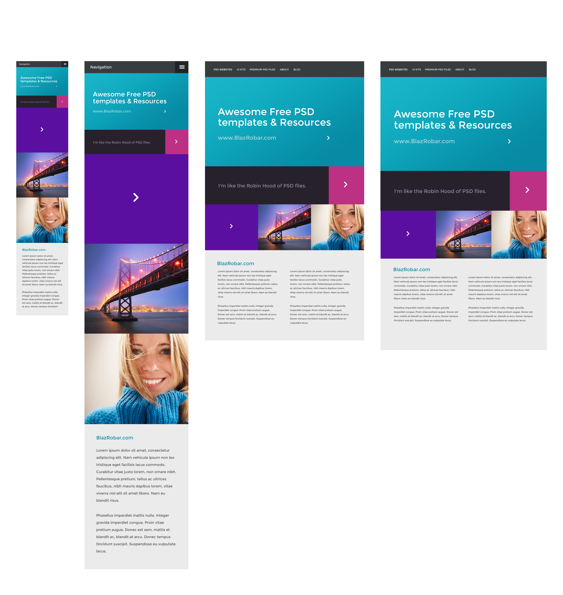

# Esercizio HTML CSS

Dato il [modello](./docs/ModelloHome.png) della pagina "responsive" riprodurre la struttura con HTML e in CSS usare il grid layout per il layout generale (basta solo la visione desktop)

